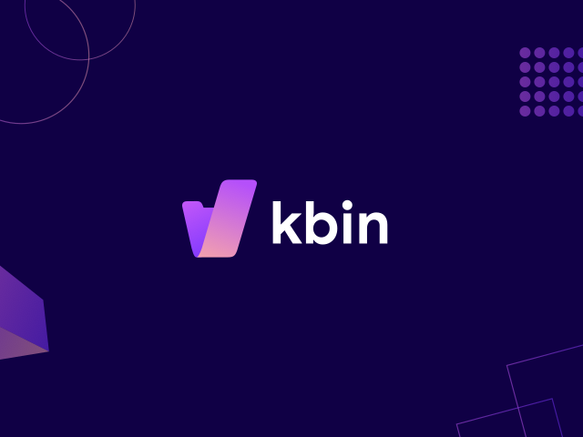

# /kbin

/kbin is a modular, decentralized content aggregator and microblogging platform running on the Fediverse network. It can
communicate with many other ActivityPub services, including Mastodon, Lemmy, Pleroma, Peertube. The initiative aims to
promote a free and open internet.

The inspiration came from platforms like [Postmill](https://postmill.xyz/), [Strimoid](https://github.com/Strimoid/Strimoid), and [Pixelfed](https://pixelfed.org/).

> _Note_:
> This is a very early beta version, and a lot of features are currently broken or in active development, such as
> federation.

- [https://kbin.pub](https://kbin.pub) - project website
- [https://kbin.social](https://kbin.social) - main instance
- [https://karab.in](https://karab.in) - Polish-lang instance
- [List of all instances](https://fedidb.org/software/kbin)

## Contributing

- [Official repository on Codeberg](https://codeberg.org/Kbin/kbin-core)
- [Mirror repository on GitHub](https://github.com/ernestwisniewski/kbin)
- [Translations](https://translate.codeberg.org/projects/kbin/)
- [#kbin-space:matrix.org](https://matrix.to/#/#kbin-space:matrix.org)
- [Contribution guidelines](docs/contributing.md) - please read first, including before opening an issue

---

## Getting Started

### Requirements

[See also Symfony requirements](https://symfony.com/doc/current/setup.html#technical-requirements)

- PHP version: 8.2 or higher
- GD or Imagemagick PHP extension
- NGINX / Apache / Caddy
- PostgreSQL
- Redis (optional)
- Mercure (optional)
- RabbitMQ (optional)

## Documentation

- [User Guide](docs/user_guide.md)
- [Unofficial Community Guide](https://unofficial-kbin-guide.surge.sh/)
- [Bare Metal Deployment Guide](docs/admin_guide.md)
- [Docker Deployment Guide](docs/docker_deployment_guide.md)
- [OAuth2 Guide](docs/oauth2_guide.md)
- [Contributing](docs/contributing.md)
- [REST API Reference](https://kbin.social/api/docs)
- [REST API Reference](https://docs.kbin.pub) (deprecated)
- [ActivityPub Reference](https://fedidevs.org/projects/kbin/)
- GraphQL Reference

## Federation

### Official Documents

- [ActivityPub standard](https://www.w3.org/TR/activitypub/)
- [ActivityPub vocabulary](https://www.w3.org/TR/activitystreams-vocabulary/)
- [Activity Streams](https://www.w3.org/TR/activitystreams-core/)

### Unofficial Sources

- [Fediverse Developer Network](https://fedidevs.org/)
- [Join the Fediverse](https://jointhefediverse.net/)
- [Join the Fediverse Wiki](https://joinfediverse.wiki/Main_Page)
- [A highly opinionated guide to learning about ActivityPub](https://tinysubversions.com/notes/reading-activitypub/)
- [ActivityPub as it has been understood](https://flak.tedunangst.com/post/ActivityPub-as-it-has-been-understood)
- [Schema Generator 3: A Step Towards Redecentralizing the Web!](https://dunglas.fr/2021/01/schema-generator-3-a-step-towards-redecentralizing-the-web/)

## Credits

### Core Team

- [ernest](https://github.com/ernestwisniewski)
- [szsz](https://github.com/SzymonKaminski)
- [cooperaj](https://github.com/cooperaj)
- [rideranton](https://codeberg.org/rideranton?tab=activity)
- [AnonymousLlama](https://github.com/simonrcodrington)

https://codeberg.org/org/Kbin/teams

### Design Team

- [cody](https://kbin.social/u/cody)

## Languages

- English
- Chinese
- Danish
- Dutch
- Esperanto
- French
- Galician
- German
- Greek
- Italian
- Japanese
- Polish
- Russian
- Spanish
- Turkish
- Ukrainian

https://translate.codeberg.org/projects/kbin/kbin/

## Donate

- [LiberaPay](https://liberapay.com/kbin)
- [Patreon](https://www.patreon.com/kbin_pub)
- [Buy me a coffee](https://www.buymeacoffee.com/kbin)

_Note:_ Please, also don't forget about all the [contributors](https://codeberg.org/Kbin/kbin-core/activity/monthly).
These are people who are actively contributing to /kbin project and are all volunteers.

## Support us

###

###
###

###
###

###
###

###
###

###
###

###

## License

[AGPL-3.0 license](https://github.com/ernestwisniewski/kbin/blob/main/LICENSE)
