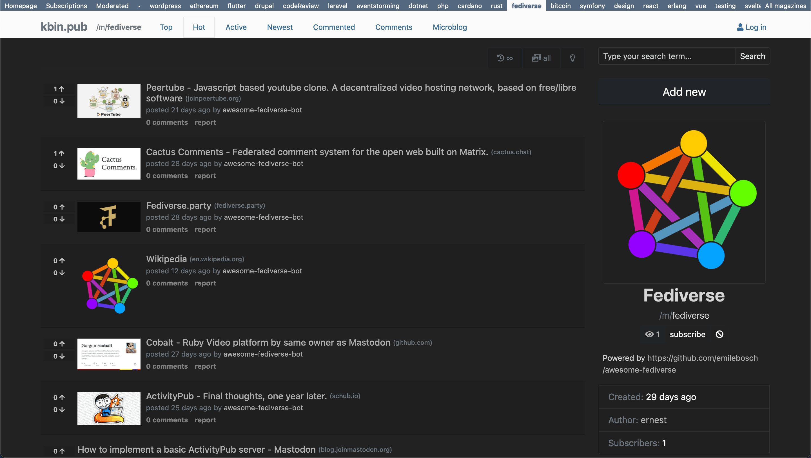
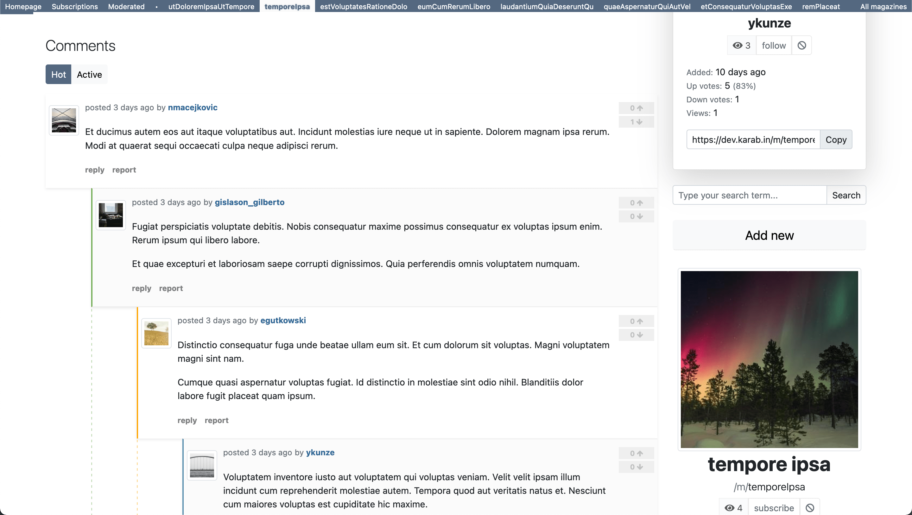
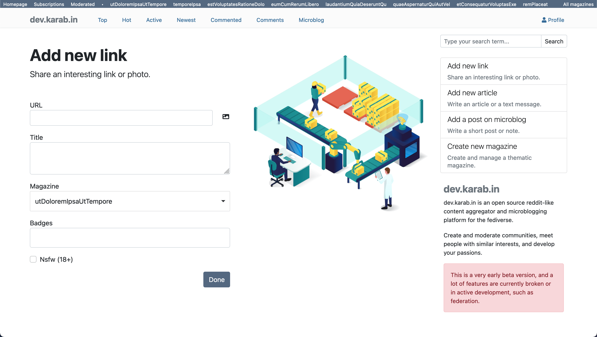

# Kbin

[](https://codeclimate.com/github/ernestwisniewski/kbin/maintainability)
[](https://codeclimate.com/github/ernestwisniewski/kbin/test_coverage)

A reddit-like content aggregator and micro-blogging platform for the fediverse.

This is a very early beta version, and a lot of features are currently broken or in active development, such as federation.

|     |     |     |
| --- | --- | --- |
  |    |  

* https://kbin.info - project website
* **https://dev.karab.in - instance for testing purposes only**
* https://karab.in - polish-lang instance

---

* [kbin-js-client](https://github.com/ernestwisniewski/kbin-js-client) (TypeScript)
* [kbin-mobile](https://github.com/ernestwisniewski/kbin-mobile) (Flutter / Dart)

## Getting Started

### Requirements

https://symfony.com/doc/5.3/reference/requirements.html

* PHP version: 8.0 or higher
* GD or Imagemagick php extension
* NGINX / Apache / Caddy
* PostgreSQL
* Mongodb (optional)
* Mercure (optional)
* RabbitMQ (optional)
* Elasticsearch (optional)
* Cardano Node, Cardano Wallet (optional)

### Frontend

https://github.com/symfony/ux

```bash
$ yarn install
$ yarn build
```

### Install with Docker

Based on https://github.com/dunglas/symfony-docker

#### Develop

```bash
# Set SMTP, Postgres, Mercure, Elasticsearch, RabbitMQ creds if you need it.
$ cp .env.example .env

$ docker-compose build --pull --no-cache
$ docker-compose up

$ docker-compose exec php bin/console doctrine:fixtures:load
$ docker-compose exec php bin/phpunit
```

#### Production

```bash
$ SERVER_NAME="beta.karab.in" \
APP_SECRET=427f5e2940e5b2472c1b44b2d06e0525 \
CADDY_MERCURE_JWT_SECRET='!ChangeMe!' \
docker-compose -f docker-compose.yml -f docker-compose.prod.yml up -d
```

## Configuration

### Admin user

```bash
# Create new user (without email verification)
$ docker-compose exec php bin/console kbin:user:create username email@exmple.com password
# Grant administrator privileges
$ docker-compose exec php bin/console kbin:user:admin username
```

### Elasticsearch
```bash
$ docker-compose exec php bin/console fos:elastica:create
$ docker-compose exec php bin/console fos:elastica:populate
```

### JWT keys
// todo 

Next, set up your instance https://localhost/admin

## Federation

* https://dunglas.fr/2021/01/schema-generator-3-a-step-towards-redecentralizing-the-web/

* https://github.com/api-platform/activity-pub

## Documentation

https://docs.kbin.info - Kbin API Reference

## Contributing

## License
